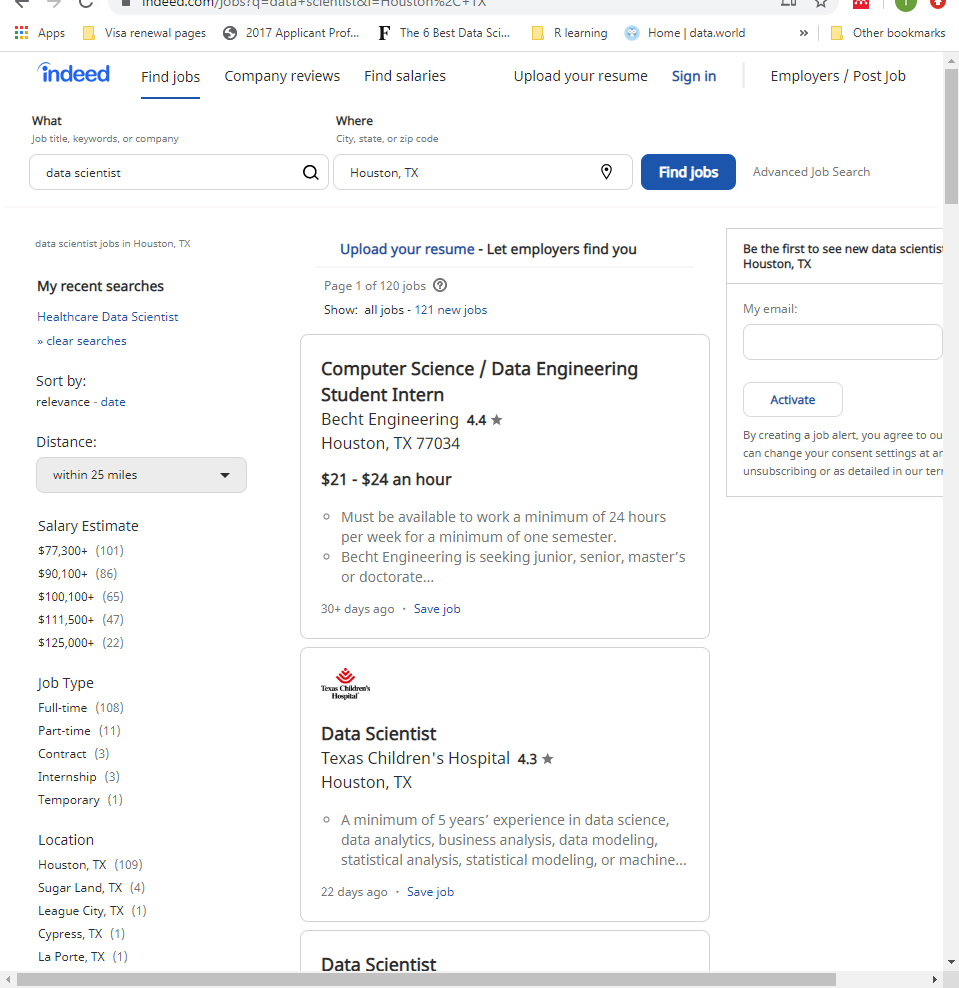

# Requirements:
- requests
- BeautifulSoup
- mysql-connector-python (to connect python with mysql)
- MySQL

# Introduction:

In this post, we'll be going over how to scrape job information from Indeed (the approached here can be used for any websites you want) using requests and BeautifulSoup.

Before going into the codes, let's first understand the problems. We want to scrape information from an Indeed job posting. For my case, I want to scrape information about data scientist roles from companies. 

Here's the search result for data scientist in Houston, TX. 

